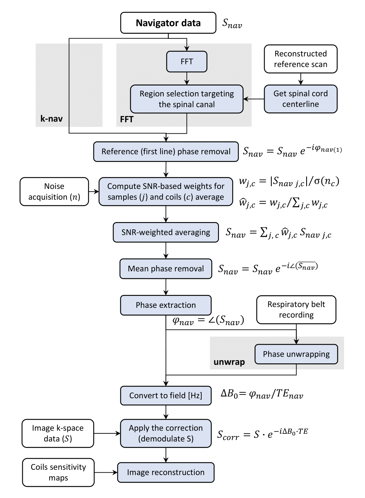

# Navigator-based correction pipelines

Standard navigator processing that has been developed for brain imaging is not sufficiently robust in the spinal cord because:
* There is higher in-plane variability in the field distribution
* The signal-to-noise ratio (SNR) is lower
* There are larger variations in signal contribution from different receiver coils

To face these challenges we introduced:
* __SNR weighted averaging__ of the navigator profile
* __mean phase removal__ to recenter the phase distribution and reduce wrapping
* __A fast Fourier transform (FFT) and spatial region selection step__. This consists of applying a one-dimensional Fourier transform to each navigator profile and considering for the phase estimate only the data points in a certain spatial interval centered on the spinal cord.
* __Phase unwrapping__ function for the navigator estimates using the respiratory trace recording.
These features are combined in multiple pipelines as shown in the figure.



The available pipelines are:
* __k_nav__ is the k-space navigator processing commonly used for brain imaging, optimized with SNR weighted averaging and mean phase removal.
* __FFT_nav__ that compared to k-nav includes an additional FFT snd spatial region selection step.
* __unwrap__ includes the phase unwrapping algorithm and makes use of the respiratory belt recordings.

MRINavigator is designed to be flexible and multiple analysis parameters are tunable. It is possible to select the correction pipeline and parameters using the params dictionary.
For more information check the [Get started](@ref) or [API](@ref) pages. Alternatively start `julia` from the command line, and type `?` to enter the help REPL mode. Then enter

```julia
help?> defaultNavParams
```

Here are listed the main features and parameters the user can select and modify:
* The Spinal cord toolbox ([SCT](https://spinalcordtoolbox.com)) can be used to locate the spinal cord centerline position (`params[:comp_centerline] = true`). To do this the reference data, which are fully sampled, are reconstructed combining the coils, and saved in [NIfTI](https://brainder.org/2012/09/23/the-nifti-file-format/) format (`params[:reconstruct_map] = true`).  The user can also manually locate the centerline if the automatic algorithm fails, selecting `params[:trust_SCT] = false`. Alternatively, the center of the image will be used (`params[:use_centerline] = false`).
* The interval width for the region selection after the FFT step can be selected (`params[:FFT_interval] = type number in millimeters`).
* The unwrap function can be applied added both to the __FFT__ and the __k nav__ pipelines. To do this type `params[:corr_type] = "FFT_unwrap"` or `params[:corr_type] = "knav_unwrap"`.